# Configure Virtual Cloud Network Peering

## Introduction

Local VCN peering is the process of connecting two VCNs in the same region and tenancy, so that their resources can communicate using private IP addresses without routing the traffic over the Internet or through your on-premises network. Without peering, a given VCN would need an Internet gateway and public IP addresses for instances that need to communicate with another VCN.

Estimated Time: 50 minutes

### Objectives
- Create two virtual cloud networks
- Create two compute instances in different VCNs
- Configure Route Tables and Security Lists to establish local peering connection between two VCNs
- Verify the peering connection

### Prerequisites
* An Oracle Cloud Account - please view this workshop's LiveLabs landing page to see which environments are supported
* SSH keys created in Oracle Cloud Shell

## Task 1: Sign in to Oracle Cloud Infrastructure Console and create VCN

>**Note:** Oracle Cloud Infrastructure (OCI) UI is being updated, thus some screenshots in the instructions may be different from the actual UI.

1. Sign in using your tenancy, user name, and password. Use the login option under **Oracle Cloud Infrastructure Direct Sign-In**.

    

2. From the OCI Services menu, click **Networking** -> **Virtual Cloud Networks**. 

    

    Select the compartment assigned to you from drop down menu on left side of the screen, and click **Create VCN**.

    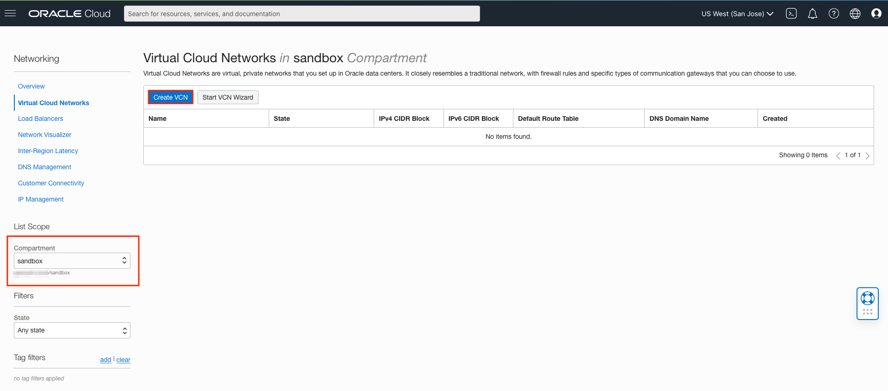

    >**Note:** Ensure the correct Compartment is selected under Compartment list.

3. Fill out the dialog box:

      - **Name**: Provide a VCN name
      - **Create in compartment**: Ensure your compartment is selected
      - **IPv4 CIDR Block**: **10.0.0.0/16**

    

4. Click **Create VCN**.

5. Virtual Cloud Network will be created and VCN name will appear on OCI Console. Scroll down to find your VCN if multiple VCN exist, and click your VCN name.

6. In VCN Details page, click **Internet Gateways** under Resources, and click **Create Internet Gateway**. Fill out the dialog box. Click **Create Internet Gateway** (ensure correct compartment is selected).

    

7. Click **Route Tables**, and click **Default Route Table for `<VCN_NAME>`**.

    

8. Click **Add Route Rules**. Fill out the dialog box:

      - **Target Type**: **Internet Gateway**
      - **Destination CIDR Block**: **0.0.0.0/0**
      - **Target Internet Gateway**: Select the Internet Gateway created in Step 6

    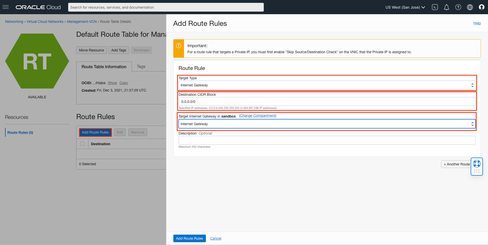

9. Click **Add Route Rules**.

10. Click on your VCN. Click **Subnets**, and then **Create Subnet**. Fill out the dialog box:

    - **Name**: Enter a name (for example subnet01)
    - **Subnet Type**: **Regional**
    - **CIDR Block**: **10.0.0.0/24**
    - **Route Table**: Select Default Route Table
    - **Subnet Access**: **Public Subnet**
    - **Dhcp Options**: Select Default DHCP Options
    - **Security Lists**: Select Default Security List

    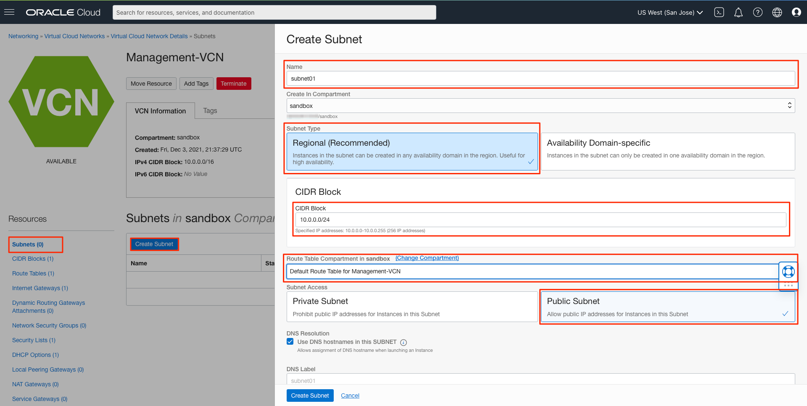

    

11. Leave all other options as default. Click **Create Subnet**.

12. Once the Subnet is in the *Available* state, click **Local Peering Gateways**, then **Create Local Peering Gateway** (local peering gateway is a component on a VCN for routing traffic to a locally peered VCN). Fill out the dialog box:

    - **Name**: Provide a name like lpg01
    - **Create in Compartment**: Select your compartment

    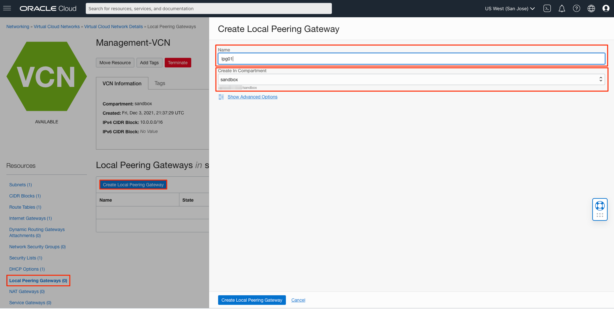

13. Click **Create Local Peering Gateway**.

14. Repeat Step 2 - 4 to create a second VCN, but this time use a non-overlapping CIDR block:

    - **IPv4 CIDR Block**: **172.16.0.0/16**

    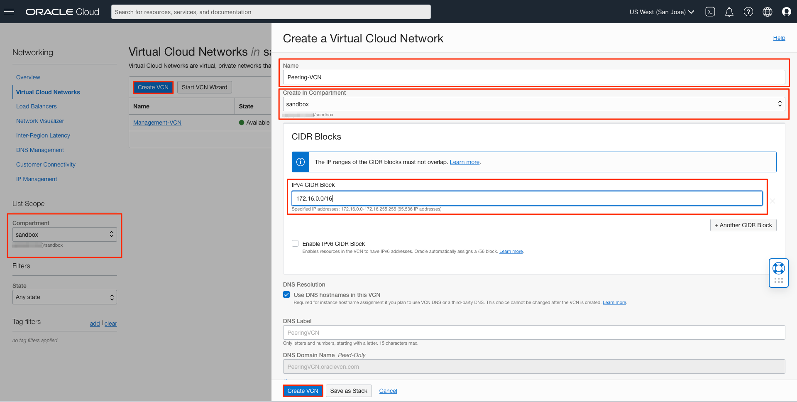

15. Repeat Step 5 - 6 to add Internet Gateway for the second VCN.

    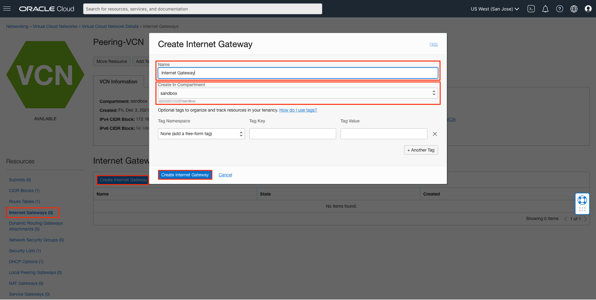

16. Add subnet for the second VCN. Click on your second VCN. Click **Subnets**, and then **Create Subnet**. Fill out the dialog box:

    - **Name**: Enter a name (for example Marketing Peering subnet)
    - **Subnet Type**: **Regional**
    - **CIDR Block**: **172.16.0.0/24**
    - **Route Table**: Select Default Route Table
    - **Subnet Access**: **Public Subnet**
    - **Dhcp Options**: Select Default DHCP Options
    - **Security Lists**: Select Default Security List

    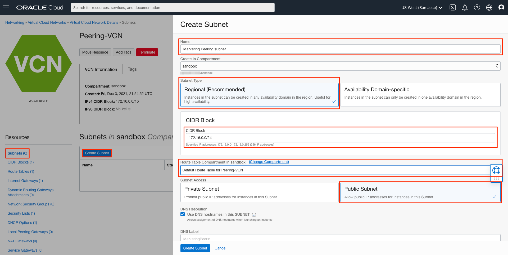
    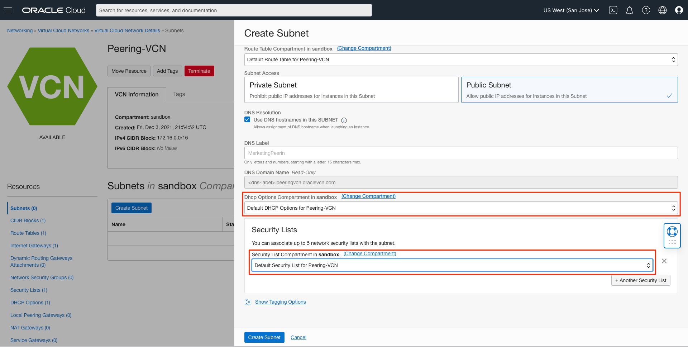

17. Leave all other options as default. Click **Create Subnet**.

18. Add route table for the second VCN. Click **Route Tables**, then **Create Route Table**. Fill out the dialog box:

    - **Name**: Provide a name
    - **Create in Compartment**: Select your Compartment

    Click **+ Another Route Rule**

    - **Target Type**: **Internet Gateway**
    - **Destination CIDR Block**: **0.0.0.0/0**
    - **Target Internet Gateway**: Select the second VCN's Internet Gateway

    

19. Leave all other options as default, Click **Create**.

20. Create a second Local Peering Gateway. Once the Subnet is in the *Available* state, click **Local Peering Gateways**, then **Create Local Peering Gateway** (local peering gateway  is a component on a VCN for routing traffic to a locally peered VCN). Fill out the dialog box:

    - **Name**: Provide a name like lpg02
    - **Create in Compartment**: Select your compartment

    

    Click **Create Local Peering Gateway**.

**We have created two VCNs with Internet gateway for Internet traffic, added default rules in the route tables, created subnets, and added two local peering gateways (one for each VCN). For VCN peering, each VCN must have a local peering gateway.**

## Task 2: Create two compute instances and configure routing

1. From OCI services menu, click **Compute** -> **Instances**.

    

2. Click **Create Instance**. Fill out the dialog box:

    **This is the first compute instance, and ensure to create in the first VCN**.

    - **Name**: Enter a name like instance01

    - **Placement**:
        - **Availability Domain**: Select an availability domain

    - **Image and shape**:
        - **Image**: We recommend using the Latest **Oracle Linux** available
        - **Shape**: Use the default shape selected

    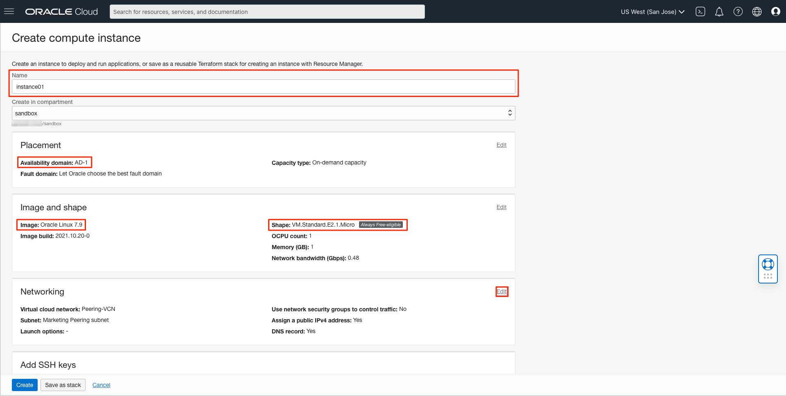

    - **Networking**: click **Edit**

        - **Virtual cloud network Compartment**: Select your compartment
        - **Virtual cloud network**: Choose the first VCN
        - **Subnet Compartment:** Choose your compartment
        - **Subnet:** Choose the Public Subnet under **Public Subnets**
        - **Public IP address**: check **Assign a public IPv4 address**
        - Click **Show advanced options**: un-check **Use network security groups to control traffic**

    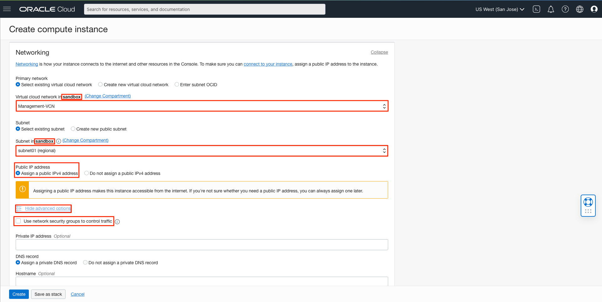

    - **Add SSH keys:** Choose **Paste public keys** and paste the public key created under Cloud Shell in Lab 1
    - **Boot volume:** Leave the default

    

3. Click **Create**.

    >**Note:** If *Service limit* error is displayed, choose a different shape from VM.Standard2.1, VM.Standard.E2.1, VM.Standard1.1, VM.Standard.B1.1, or choose a different availability domain.

4. Repeat the steps to create a second compute instance in the **second VCN**.

    - **Name**: Enter a name like instance02

    - **Placement**:
        - **Availability Domain**: Select an availability domain

    - **Image and shape**:
        - **Image**: We recommend using the Latest **Oracle Linux** available
        - **Shape**: Use the default shape selected

    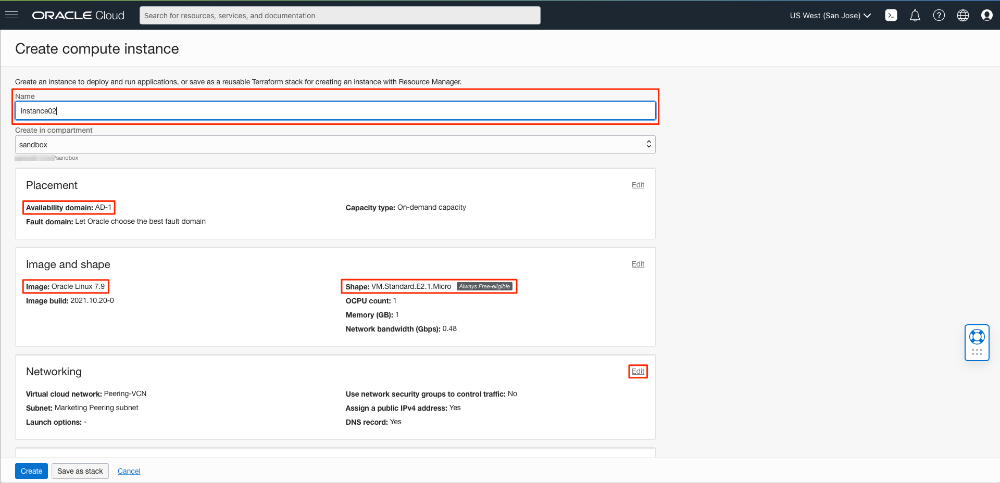

    - **Networking**: click **Edit**

        - **Virtual cloud network Compartment**: Select your compartment
        - **Virtual cloud network**: Choose the second VCN
        - **Subnet Compartment:** Choose your compartment
        - **Subnet:** Choose the Public Subnet under **Public Subnets**
        - **Public IP address**: check **Assign a public IPv4 address**
        - Click **Show advanced options**: un-check **Use network security groups to control traffic**
    
    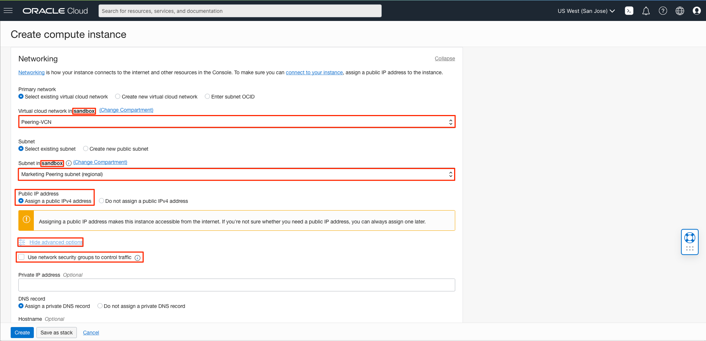

    - **Add SSH keys:** Choose **Paste public keys** and paste the public key created under Cloud Shell in Lab 1
    - **Boot volume:** Leave the default

5. Click **Create**.

6. Once the instances are in running state, note down the *public IP* and *private IP* addresses of the two compute instances.

7. Configure the **first local peering gateway**. Go to your first VCN Details page, and click **Local Peering Gateways**. Hover over the action icon (3 vertical dots) and click **Establish Peering Connection**.

    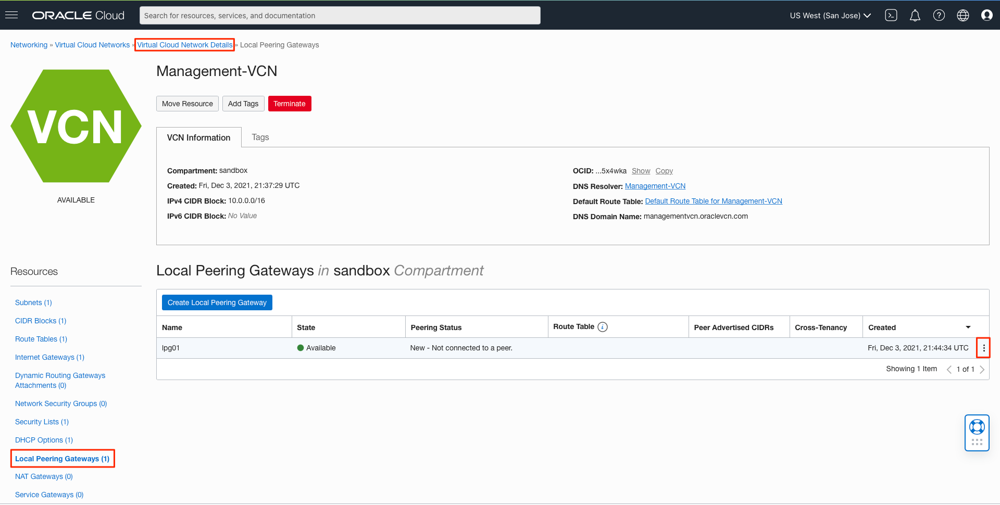

8. Fill out the dialog box:

    - Specify the Local Peering Gateway: **Browse Below** (to browse the list of available gateways)
    - Virtual Cloud Network Compartment: Select your compartment
    - Virtual Cloud Network: Choose the **second VCN** (Gateway1 needs to pair with Gateway2 that is in the second VCN)
    - Local Peering Gateway Compartment: Select your compartment
    - Unpeered Peer Gateway: Choose the second local peering gateway

    Click **Establish Peering Connection**.

    

9. Verify the Local Peering Gateway shows Status as *Peered* and Peered information is correct.

    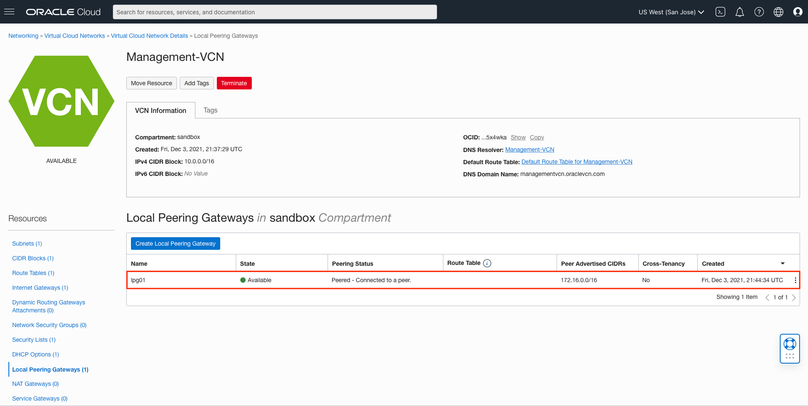

10. We now need to configure Route Tables and Security Lists for the two VCNs. Navigate to the first VCN's Details page and click **Route Tables**, then **Default Route Table for `<FIRST_VCN_NAME>`**.

    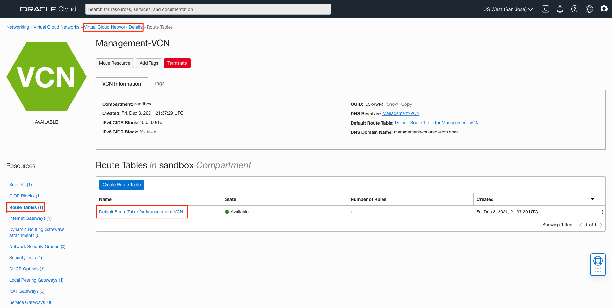

11. Click **Add Route Rules** and add the following rule:

    - Target Type: **Local Peering Gateway**
    - Destination CIDR Block: **172.16.0.0/24**
    - Compartment:  Make sure the correct Compartment is selected
    - Target Local Peering Gateway: Select the Local Peering Gateway of the first VCN

    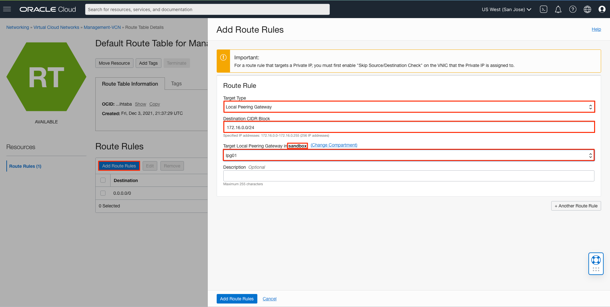

12. Click **Add Route Rules**.

13. Navigate to your first VCN's Details page. Click **Security Lists**, then **Default Security List for `<FIRST_VCN_NAME>`**.

    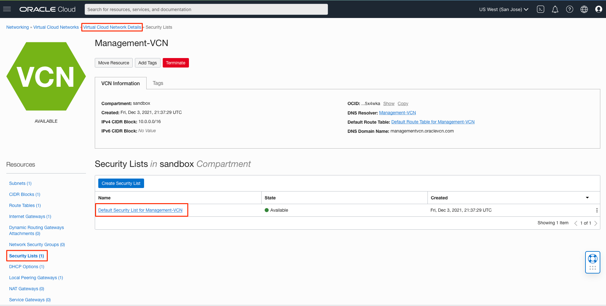

14. Click **Add Ingress Rules**. Enter the following Ingress Rule. Ensure to leave **Stateless** flag un-checked.

    - Source CIDR: **172.16.0.0/24**
    - IP Protocol: **ICMP**

    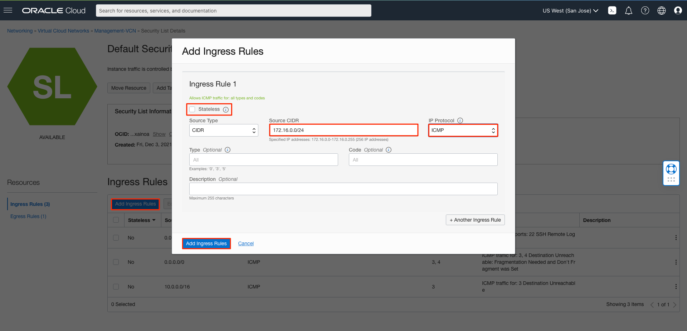

15. Click **Add Ingress Rules**.

16. Repeat Step 10 - 12 for the second VCN's Route Table. Navigate to the second VCN's Details page and click **Route Tables**, then **Default Route Table for `<SECOND_VCN_NAME>`**. 
    
    Click **Add Route Rules** and add the following rule:
    
    **Second VCN Route Table:**

    - Target Type: **Local Peering Gateway**
    - Destination CIDR Block: **10.0.0.0/24**
    - Compartment:  Make sure the correct Compartment is selected
    - Target Local Peering Gateway: Select the Local Peering Gateway of the second VCN
    
    Click **Add Route Rules**.

    

17. Repeart Step 13 - 15 for the second VCN's Security List. Navigate to you VCN details page. Click **Security Lists**, then **Default Security List for `<SECOND_VCN_NAME>`**. 
    
    Click **Add Ingress Rules**. Enter the following Ingress Rule. Ensure to leave **Stateless** flag un-checked.

    **Second VCN Security List Rule:**
    - Source CIDR: **10.0.0.0/24**
    - IP Protocol: **ICMP**
    
    Click **Add Ingress Rules**.
    
    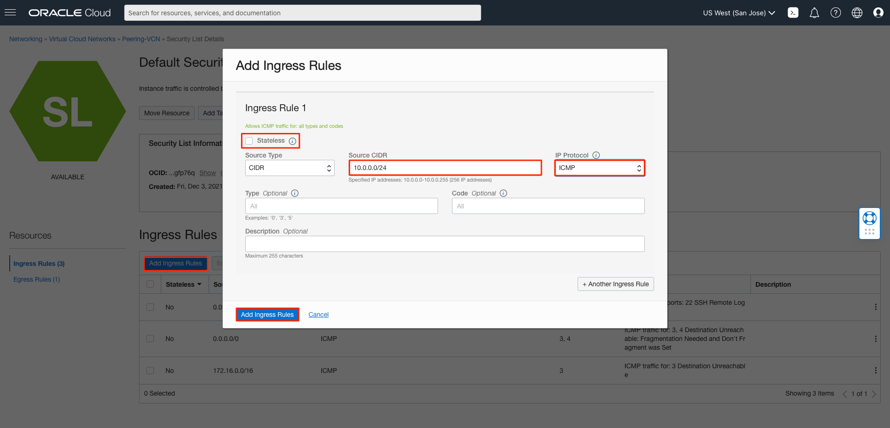

**We now have two VCNs with one compute instance in each VCN. These VCNs have been connected using a Local Peering Gateway. Any instance in one VCN can reach any instance in the other VCN. Next we will test the connectivity.**

## Task 3: SSH to compute instance and test VCN Peering

1. Using Cloud Shell, enter the following command:

    ```
    <copy>
    cd ~/.ssh/
    </copy>
    ```

2. Enter **ls** and verify that your ssh file exists.

3. Enter command:

    ```
    <copy>
    ssh -i <sshkeyname> opc@<PUBLIC_IP_OF_FIRST_COMPUTE>
    </copy>
    ```

    **We will SSH to the first compute instance**.

    >**Note:** User name is opc. This will enable port forwarding on local host.

    **HINT:** If *Permission denied error* is seen, ensure you are using '-i' in the ssh command.

4. Enter **yes** when prompted for security message.

5. Verify opc@`<COMPUTE_INSTANCE_NAME>` appears on the prompt.

    

6. Enter command:

    ```
    <copy>
    ping <PRIVATE_IP_OF_SECOND_COMPUTE_INSTANCE>
    </copy>
    ```

    >**Note:** Use Private IP of the compute instance that you are not connected to.

    **Verify the ping is successful.**
    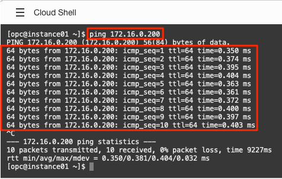

    If ping is successful, then we have successfully created VCN peering across two different VCNs.

## Task 4: Delete the resources

1. Switch to  OCI console window.

2. If your compute instances are not displayed, from OCI services menu, click **Instances** under **Compute**.

    

3. Locate your compute instances. Click Action icon and then **Terminate**.

    

4. Make sure **Permanently delete the attached boot volume** is checked. Click **Terminate instance**. Wait for the instance to be fully terminated.

    

5. Repeat Step 3 - 4 to delete the second compute instance.

6. From OCI services menu, click **Virtual Cloud Networks** under **Networking**. A list of all VCNs will appear.

    

7. Locate your VCN. Click Action icon and then **Terminate**. Click **Delete All** in the Confirmation window. Click **Close** once VCN is deleted.

    

8. Repeat Step 7 to delete the second VCN.

*Congratulations! You have successfully completed the lab.*

## Acknowledgements

- **Author** - Umair Siddiqui, Larry Beausoleil
- **Adapted by** -  Yaisah Granillo, Cloud Solution Engineer
- **Last Updated By/Date** - Arabella Yao, Product Manager, Database Product Management, December 2021